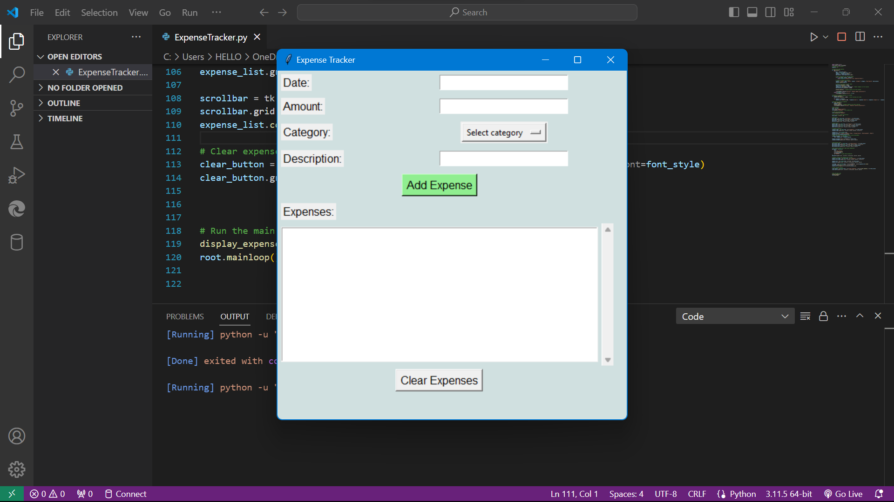
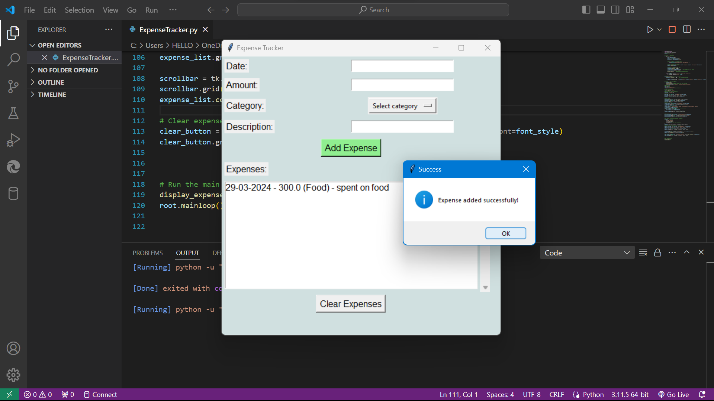

# ExpenseTracker

Expense Tracker is a simple Python application built using tkinter library to track daily expenses. With this application, users can easily add their daily expenses, categorize them, and view a list of all expenses entered.

## Features

- Add expenses with date, amount, category, and description.
- Categorize expenses into predefined categories such as Food, Transportation, Entertainment, and Others.
- View a list of all expenses entered.
- Clear all expenses at once.

## How to Use

1. Clone the repository to your local machine.
2. Make sure you have Python installed.
3. Run the `expense_tracker.py` file.
4. Enter the details of your expense and click on "Add Expense" button.
5. View all your expenses in the listbox.
6. To clear all expenses, click on the "Clear Expenses" button.

## Dependencies

- Python 3.x

## Screenshots

